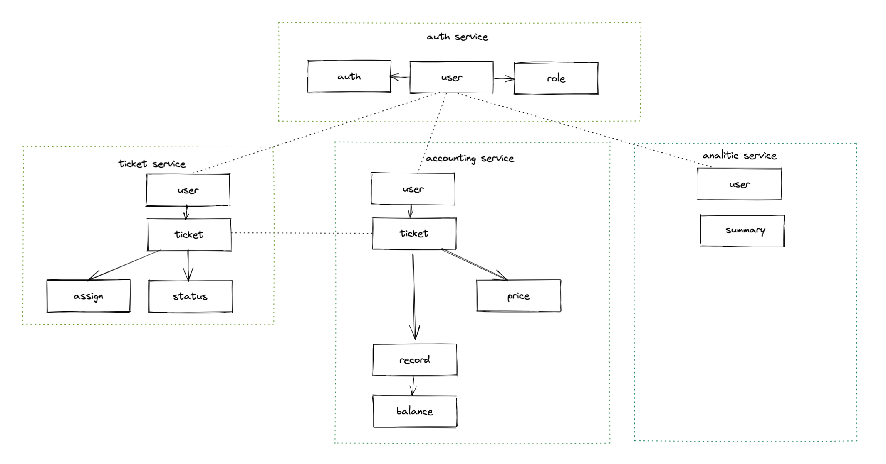

# Event storming

## Таск-трекер

### Таск-трекер должен быть отдельным дашбордом и доступен всем сотрудникам компании UberPopug Inc.  
**Actor** User  
**Command** Login to TaskTracker  
**Data** UberPopug auth service  
**Event** User.Logged

### Новые таски может создавать кто угодно (администратор, начальник, разработчик, менеджер и любая другая роль). У задачи должны быть описание, статус (выполнена или нет) и попуг, на которого заассайнена задача.  
**Actor**  User  
**Command** Create task  
**Data** Task, Status  
**Event** Task.Created

**Actor**  Task.Created  
**Command** Assign task  
**Data** Task, Assign  
**Event** Task.Assigned

### Менеджеры или администраторы должны иметь кнопку «заассайнить задачи», которая возьмёт все открытые задачи и рандомно заассайнит каждую на любого из сотрудников   
**Actor** User with role in (Manager,Administrator)  
**Command** Assign tasks  
**Data** [ Task ], [ Status ], [ Assign ], [ Users ] with role not in (Manager,Administrator)  
**Event** [ Task.Assigned ]

### Каждый сотрудник должен иметь возможность видеть в отдельном месте список заассайненных на него задач + отметить задачу выполненной.
  
**Actor** User  
**Command** View tasks  
**Data** [ Task ], [ Status ] ,[ Assign ], User  
**Event** [ Task.Viewed ]
  
**Actor** User  
**Command** Task complete  
**Data** Task, Status, User  
**Event** Task.Completed

## Аккаунтинг

### Авторизация в дешборде аккаунтинга должна выполняться через общий сервис аутентификации UberPopug Inc.
  
**Actor** User  
**Command** Login to TaskTracker  
**Data** UberPopug auth service  
**Event** User.Logged 

### Расценки на задачу определяется единоразово, в момент появления в системе (можно с минимальной задержкой)
  
**Actor** Task.Created  
**Command** Task set price  
**Data** Task, Price  
**Event** Price.Set

### У каждого из сотрудников должен быть свой счёт, который показывает, сколько за сегодня он получил денег. У счёта должен быть аудитлог того, за что были списаны или начислены деньги, с подробным описанием каждой из задач
  
**Actor** User  
**Command** View account  
**Data** [ Task ], [ Record ]  
**Event** Record.Added

### Деньги списываются сразу после ассайна на сотрудника, а начисляются после выполнения задачи.
  
**Actor** Task.Assigned  
**Command** Add negative balance record  
**Data** Task, Price, Assign, Record  
**Event** Record.Added
  
**Actor** Task.Completed  
**Command** Add positive balance record  
**Data** Task, Price, Assign, Record  
**Event** Record.Added
  
**Actor** Record.Added  
**Command** Update balance  
**Data** User, Record  
**Event** Balance.Updated

### Дешборд должен выводить количество заработанных топ-менеджментом за сегодня денег
  
**Actor** User with role in (Administrator, Accountant)  
**Command** Show current  
**Data** [ Record ]  
**Event** Current.Viewed

### считать сколько денег сотрудник получил за рабочий день/отправлять на почту сумму выплаты
  
**Actor** End of day  
**Command** Take stock  
**Data** [ Balance ], Record  
**Event** Record.Finalize
  
**Actor** Record.Finalize  
**Command** Nullify balance  
**Data** Balance  
**Event** Balance.Nullified
  
**Actor** Balance.Nullified  
**Command** Send payment info  
**Data** Balance, User  
**Event** User.Notified

## Аналитика

### Аналитика — это отдельный дашборд, доступный только админам.  
**Actor** User with role Administrator  
**Command** Login to Analitics  
**Data** ???  
**Event** User.Autorized 

### Нужно указывать, сколько заработал топ-менеджмент за сегодня и сколько попугов ушло в минус
  
**Actor** Autorized User  
**Command** View Analitics  
**Data** Summary  
**Event** Analitics.Viewed
  
**Actor** Record.Added  
**Command** Update max price in summary  
**Data** Record  
**Event** Summary.UpdatedHighestPrice
  
**Actor** Balance.Updated  
**Command** Update nulled popugs in summary  
**Data** Balance  
**Event** Summary.UpdatedNulledPopugs

# Модель данных

# Модель доменов

# Сервисы

# События
## Бизнес-события
**Продьюсер->Консьюмер**
### Авторизация 
*синхронное* 
Ticket->Auth
Accounting->Auth
Analitic->Auth
### Тикет создан
*асинхронное* 
Ticket->Accounting
### Тикет выполнен
*асинхронное* 
Ticket->Accounting
### Тикет назначен
*асинхронное* 
Ticket->Accounting
### Добавлена запись в аудит лог
*асинхронное* 
Accounting->Analitic
### Изменен баланс
*асинхронное* 
Accounting->Analitic
## CUD события
**Продьюсер->Консьюмер**
### Создан-обновлен-удален пользователь
*асинхронное* 
Auth->Ticket
Auth->Accounting
Auth->Analitic
### Изменены права пользователя
*асинхронное* 
Auth->Ticket
Auth->Accounting
Auth->Analitic
### Тикет изменен
*асинхронное* 
Ticket->Accounting

FYI
Не могу определиться с размещением назначения стоимости тикета(
